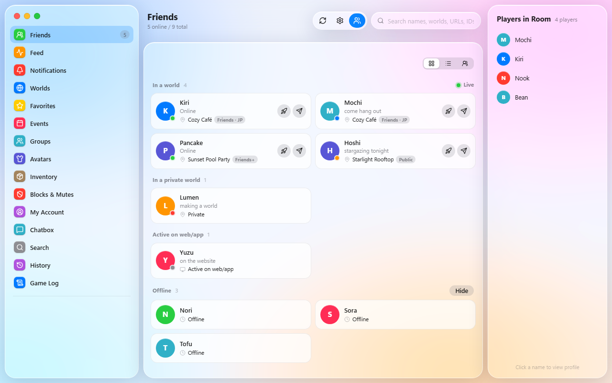
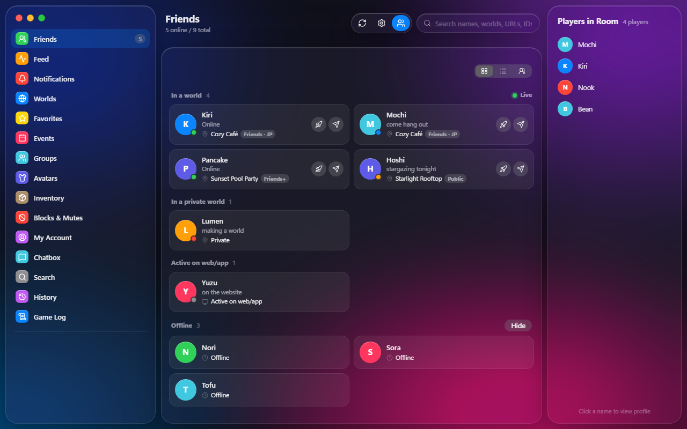
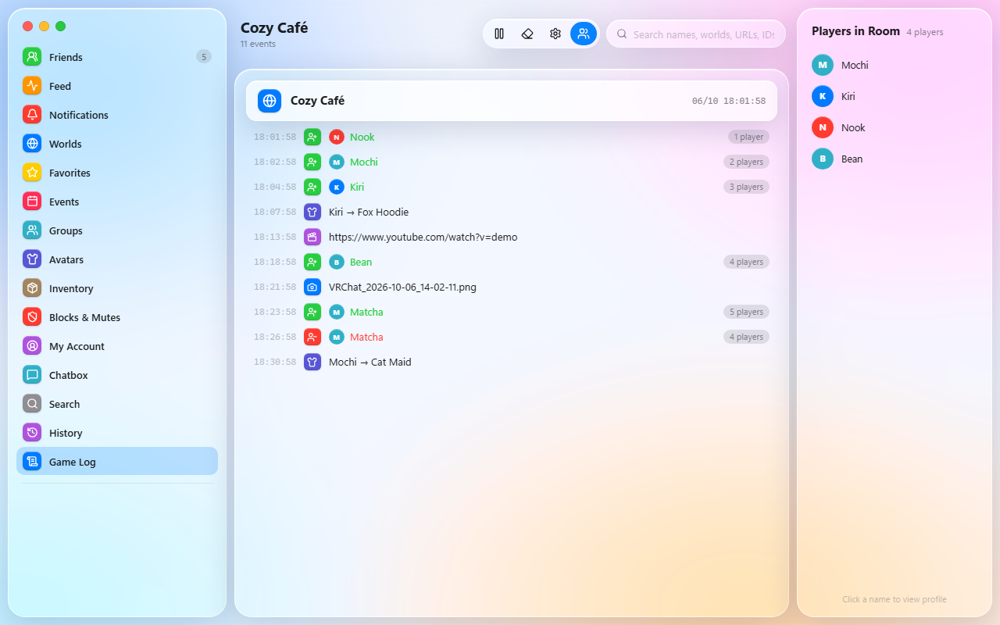
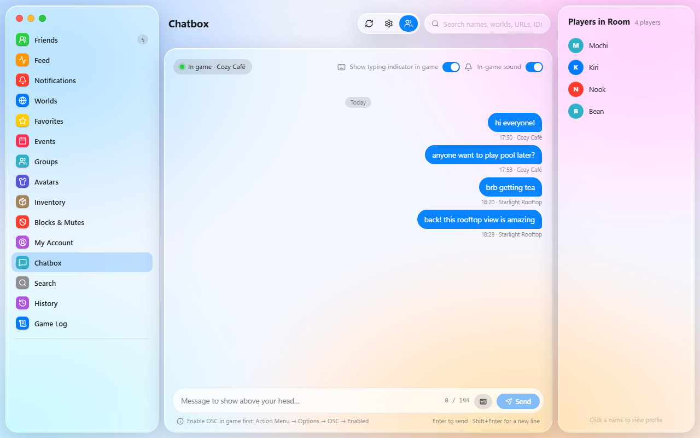
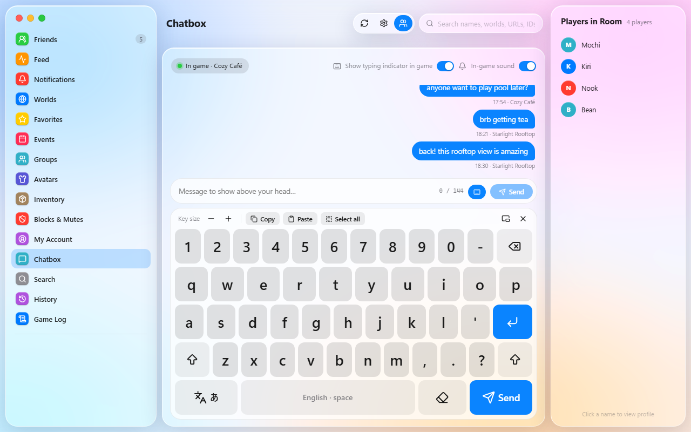
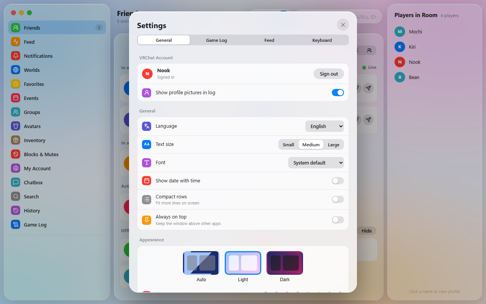
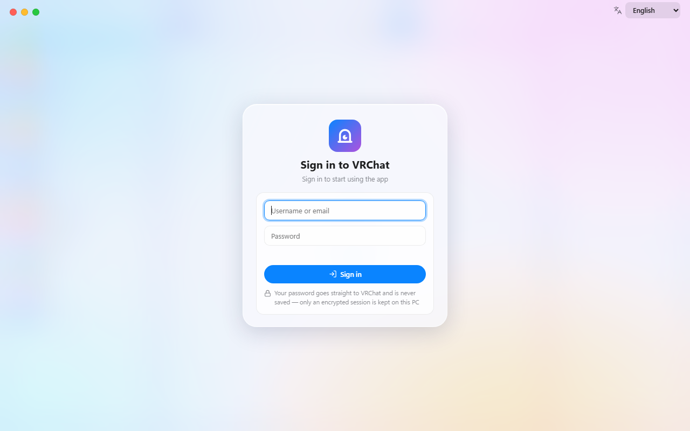

<p align="center"></p>

<h1 align="center">VRC Nook</h1>

<p align="center">Windows 用の軽量で居心地のいい VRChat コンパニオンアプリ。フレンド、ゲームログ、ゲーム内チャットボックス、VR 向けキーボード、アニメーション絵文字メーカーをひとつに。</p>

<p align="center">
<a href="README.md">English</a> · <a href="README.th.md">ไทย</a> · <b>日本語</b> · <a href="README.ko.md">한국어</a> · <a href="README.ru.md">Русский</a> · <a href="README.vi.md">Tiếng Việt</a> · <a href="README.zh.md">中文</a>
</p>

---

<p align="center"></p>

## ダウンロード

[最新リリース](https://github.com/iriewiew/vrc-nook/releases/latest)から `VRCNook.exe` をダウンロードして起動するだけです。インストールは不要です。
ドキュメントなど書き込み可能なフォルダーに置いてください。アプリは自分自身を上書きして更新するため、Program Files は避けてください。

**動作環境:** Windows 10/11 と Microsoft Edge WebView2(Windows 11 には標準搭載)

## スクリーンショット

<table>
<tr><td><br><sub>ダークテーマ</sub></td><td><br><sub>ゲームログ</sub></td></tr>
<tr><td><br><sub>チャットボックス</sub></td><td><br><sub>VR キーボード</sub></td></tr>
<tr><td><br><sub>設定</sub></td><td><br><sub>言語選択付きのサインイン</sub></td></tr>
</table>

<sub>スクリーンショットは架空のデモデータです。</sub>

## 軽量

- **約 23 MB の単一ファイル:** インストーラーも追加のランタイムも不要です(Python は同梱済み)。
- **ブラウザーを同梱しない:** UI は Windows に標準搭載の WebView2 で動くため、Chromium を丸ごと抱えていません。
- **VRChat API にやさしい:**
  - バックグラウンドの通信はすべて、頻度を制限したひとつのキューを通ります。
  - 画像はディスクにキャッシュし、小さいサイズで取得します。
  - オフラインのフレンドの画像は、プロフィールを開いたときだけ読み込みます。
- **バックグラウンドで静か:** ゲームログは新しい行だけを読み込み、システムトレイに常駐できます。
- **データは 1 か所に:** すべて `%APPDATA%\VRCNook` に保存されます。`cache\` はいつ削除しても大丈夫です。

## 機能

### フレンドとソーシャル
- **リアルタイムのフレンドリスト:** VRChat の WebSocket を使用します。パブリックワールド、プライベートワールド、Web でオンライン、オフラインに分けて表示します。
- **表示:** 表示モードを切り替えられ、各フレンドの最終オンライン時刻も確認できます。
- **プロフィールカード:** バナー、プロフィールフレーム、バッジ、自己紹介、リンク、共通のフレンド、名前の履歴を表示します。
  - 個人メモは VRChat と同期します。
  - カードからの操作: 招待、招待リクエスト、絵文字付き Boop、お気に入り、ブロック・ミュート。
- **フィード:** フレンドのステータス、場所、アバター、表示名の変更。
- **通知:** 招待、フレンドリクエスト、グループ通知。定型メッセージで返信できます(VRC+ なら画像も添付可能)。
- **Windows 通知**とシステムトレイアイコン。Windows 起動時に自動で開くこともできます。

### ゲームログ
- **VRChat のログをリアルタイムで読み取り:** ワールドへの参加、プレイヤーの入退室、動画、スクリーンショット、ステッカー、切断など。
- **フィルター:** 表示するイベントの種類を選べます。
- **永続的な履歴:** ローカルの SQLite データベースに保存します。VRChat は古いログを削除しますが、VRC Nook には残ります。
- **ワールド履歴:** 訪れたすべてのワールドとインスタンス、そこで会ったプレイヤー。

### VRChat のコンテンツ
- **ワールドとインスタンス:** ワールドの閲覧、インスタンスの作成、VRChat でワールドを開く、ワールドストアの確認。
- **お気に入り:** フレンド、ワールド、アバター。
- **イベント:** VRChat のイベントカレンダーと Jams。
- **グループ:** 閲覧と管理(メンバー、招待、リクエスト、BAN、グループインスタンス)。
- **アバター:**
  - アバターの切り替えと、プラットフォームごとのファイルサイズ・パフォーマンスの確認。
  - avtrdb.com による公開アバター検索。
- **インベントリ:** VRC+ アイコン、写真、プリント、絵文字、ステッカー、プロップ。
- **検索:** ユーザー、ワールド、グループ、イベント。リンクや ID を貼り付けるだけでも開けます。
- **マイアカウント:** 自己紹介、リンク、ステータスの編集。ブロック・ミュートの管理。

### アニメーション絵文字メーカー
- **素材:** アニメーション GIF、アニメーション WebP、または複数の画像(1 枚 = 1 フレーム)。
- **編集:**
  - フレーム範囲とフレーム数を選べます。
  - クロマキーで背景を除去できます(プレビューをクリックして色を選択)。
- **出力:** VRChat 形式の 1024×1024 スプライトシートを自動で作成します。
- **プレビュー:** 各アニメーションスタイルの見た目を VRChat 公式のプレビューで確認し、そのままアップロードできます。

### ゲーム内チャットボックス (OSC)
- **チャットページ:** アプリで入力した文字がゲーム内のチャットボックスに表示されます。送信履歴付きです。
- **表示:** 入力中はゲーム内に「入力中…」を表示します。通知音のオン・オフも選べます。

### VR 向けスクリーンキーボード
- **VR 向けの設計:** 大きなキーでサイズ調整可能。コピー、貼り付け、すべて選択ボタン付き。
- **フローティングキーボード:**
  - 常に最前面に表示され、フォーカスを奪いません。
  - **ゲーム内チャットモード:** チャットボックスに送信します。
  - **Windows キーボードモード:** どのアプリにも入力できます。タスクビューボタン付き。
- **レイアウト:** タイ語、英語、ひらがな・カタカナ、韓国語、ロシア語、ベトナム語、中国語ピンイン、絵文字。
  - 韓国語は音節を自動で組み立てます。
  - ベトナム語とピンインには声調キーがあります。
- **設定:** 言語切り替えキーで巡回するレイアウトを選べます。

### カスタマイズ
- **アプリの表示言語(7 言語):** ไทย, English, 日本語, 한국어, Русский, Tiếng Việt, 中文
- **テーマ:** ライト・ダークに加え、グラデーションの色を自由に設定できます。
- **フォント:** Noto Sans Thai などの Google Fonts。文字サイズも変更できます。
- **ウィンドウ:** 最前面表示、トレイへの最小化。

### アップデート
- **自動確認:** 起動時に GitHub Releases を確認し、ワンクリックで更新できます。
- **検証:** ダウンロード元はこのリポジトリのみで、SHA-256 が一致したファイルだけをインストールします。

## プライバシーとセキュリティ

- **パスワードは保存しません。** パスワードは VRChat に直接送信されます。
  - 保存するのは Windows DPAPI で暗号化したセッション Cookie だけで、あなたの Windows アカウントでしか復号できません。
- **ログイン Cookie は `api.vrchat.cloud` にだけ送信します。** 別のホストへリダイレクトされる場合は取り除きます。
- **すべてのデータは PC 内の `%APPDATA%\VRCNook` に保存します:**
  - 設定
  - ゲームログのデータベース
  - メモとチャット履歴
  - 画像キャッシュ
- **その他の通信:**
  - [avtrdb.com](https://avtrdb.com): 公開アバター検索のときだけ。送るのは検索文字列のみです。
  - Google Fonts: Web フォントを選んだときだけ。
  - `assets.vrchat.com`: エフェクトのプレビュー。
  - `api.github.com`: アップデート確認。

## データフォルダー

```
%APPDATA%\VRCNook\
├─ session.bin     暗号化されたログインセッション
├─ settings.json   設定
├─ data.db         ゲームログ・フィード・メモ・名前履歴・チャット履歴 (SQLite)
├─ debug.log       エラーログ
└─ cache\          画像とプロフィールデータ(削除しても再取得されます)
```

## ソースからビルド

```powershell
pip install -r requirements.txt
python vrclog_mac.py          # 実行
.\build.ps1                   # dist\VRCNook.exe をビルド
```

各ファイルの説明は[英語版 README](README.md#build-from-source) を参照してください。

## クレジット

- 作者: **iriewiew**
- アイコン: [Lucide](https://lucide.dev) (ISC License)
- アニメーション絵文字メーカーのアイデアは Wakamu さんの [VRCEmoji](https://github.com/Wakamu/VRCEmoji) から。ゼロから書かれており、コードは共有していません。
- API リファレンス: [vrchat.community](https://vrchat.community)
- アイデアは [VRCX](https://github.com/vrcx-team/VRCX) から着想を得ました。VRC Nook はゼロから書かれており、コードは共有していません。

## ライセンス

[MIT](LICENSE) © iriewiew

> VRC Nook はファンによる非公式ツールで、VRChat Inc. とは関係がなく、承認も受けていません。
> サードパーティアプリへの公式サポートがない VRChat API を使用しています。自己責任で、VRChat の利用規約に従ってご利用ください。
