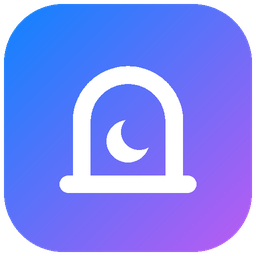

<p align="center"></p>

<h1 align="center">VRC Nook</h1>

<p align="center">Windows용 아늑한 올인원 VRChat 도우미 앱: 친구, 게임 로그, 게임 내 채팅박스, VR용 키보드, 움직이는 이모지 제작기를 한곳에.</p>

<p align="center">
<a href="README.md">English</a> · <a href="README.th.md">ไทย</a> · <a href="README.ja.md">日本語</a> · <b>한국어</b> · <a href="README.ru.md">Русский</a> · <a href="README.vi.md">Tiếng Việt</a> · <a href="README.zh.md">中文</a>
</p>

---

## 다운로드

[최신 릴리스](https://github.com/iriewiew/vrc-nook/releases/latest)에서 `VRCNook.exe`를 받아 실행하면 됩니다. 설치는 필요 없습니다.
문서 폴더처럼 쓰기 가능한 폴더에 두세요. 앱이 스스로 파일을 덮어써서 업데이트하므로 Program Files는 피하세요.

**요구 사항:** Windows 10/11, Microsoft Edge WebView2 (Windows 11에는 기본 포함)

## 기능

### 친구 및 소셜
- **실시간 친구 목록:** VRChat WebSocket을 사용합니다. 공개 월드, 비공개 월드, 웹에서 온라인, 오프라인으로 나눠 보여 줍니다.
- **보기:** 보기 방식을 바꿀 수 있고 친구별 마지막 접속 시간도 볼 수 있습니다.
- **프로필 카드:** 배너, 프로필 프레임, 배지, 소개, 링크, 함께 아는 친구, 이름 변경 기록을 보여 줍니다.
  - 개인 메모는 VRChat과 동기화됩니다.
  - 카드에서 할 수 있는 작업: 초대, 초대 요청, 이모지 Boop, 즐겨찾기, 차단·음소거.
- **피드:** 친구의 상태, 위치, 아바타, 표시 이름 변경.
- **알림:** 초대, 친구 요청, 그룹 알림. 미리 만든 메시지로 답장할 수 있습니다(VRC+면 이미지 첨부 가능).
- **Windows 알림**과 시스템 트레이 아이콘. Windows 시작 시 자동 실행도 할 수 있습니다.

### 게임 로그
- **VRChat 로그를 실시간으로 읽기:** 월드 입장, 플레이어 입장·퇴장, 동영상, 스크린샷, 스티커, 연결 끊김 등.
- **필터:** 표시할 이벤트 종류를 고를 수 있습니다.
- **영구 기록:** 로컬 SQLite 데이터베이스에 저장합니다. VRChat은 오래된 로그를 지우지만 VRC Nook에는 남아 있습니다.
- **월드 기록:** 방문한 모든 월드와 인스턴스, 그리고 거기서 만난 플레이어.

### VRChat 콘텐츠
- **월드와 인스턴스:** 월드 둘러보기, 인스턴스 만들기, VRChat에서 월드 열기, 월드 상점 보기.
- **즐겨찾기:** 친구, 월드, 아바타.
- **이벤트:** VRChat 이벤트 캘린더와 Jams.
- **그룹:** 둘러보기와 관리(멤버, 초대, 요청, 차단, 그룹 인스턴스).
- **아바타:**
  - 아바타 변경과 플랫폼별 파일 크기·성능 확인.
  - avtrdb.com을 통한 공개 아바타 검색.
- **인벤토리:** VRC+ 아이콘, 사진, 프린트, 이모지, 스티커, 프롭.
- **검색:** 사용자, 월드, 그룹, 이벤트. 링크나 ID를 붙여 넣어도 열 수 있습니다.
- **내 계정:** 소개, 링크, 상태 수정. 차단·음소거 관리.

### 움직이는 이모지 제작기
- **원본:** 움직이는 GIF, 움직이는 WebP, 또는 여러 장의 이미지(한 장 = 한 프레임).
- **편집:**
  - 프레임 구간과 프레임 수를 고를 수 있습니다.
  - 크로마 키로 배경을 지울 수 있습니다(미리보기를 클릭해 색 선택).
- **결과물:** VRChat 형식의 1024×1024 스프라이트 시트를 자동으로 만듭니다.
- **미리보기:** 애니메이션 스타일마다 VRChat 공식 미리보기로 확인한 뒤 바로 업로드할 수 있습니다.

### 게임 내 채팅박스 (OSC)
- **채팅 페이지:** 앱에서 입력한 내용이 게임 내 채팅박스에 표시됩니다. 보낸 기록도 남습니다.
- **표시:** 입력하는 동안 게임 안에 "입력 중…"을 띄웁니다. 알림음은 켜고 끌 수 있습니다.

### VR용 화면 키보드
- **VR에 맞춘 설계:** 큰 키, 크기 조절 가능. 복사, 붙여넣기, 전체 선택 버튼이 있습니다.
- **분리형 플로팅 키보드:**
  - 항상 위에 표시되고 포커스를 빼앗지 않습니다.
  - **게임 채팅 모드:** 채팅박스로 보냅니다.
  - **Windows 키보드 모드:** 어떤 앱에든 입력할 수 있습니다. 작업 보기 버튼이 있습니다.
- **자판:** 태국어, 영어, 히라가나·가타카나, 한국어, 러시아어, 베트남어, 중국어 병음, 이모지.
  - 한국어는 음절을 자동으로 조합합니다.
  - 베트남어와 병음은 성조 키를 지원합니다.
- **설정:** 언어 전환 키가 순환할 자판을 고를 수 있습니다.

### 꾸미기
- **앱 언어 7개:** ไทย, English, 日本語, 한국어, Русский, Tiếng Việt, 中文
- **테마:** 라이트·다크 테마와 직접 정하는 그라데이션 색상.
- **글꼴:** Noto Sans Thai 등 Google Fonts. 글자 크기도 바꿀 수 있습니다.
- **창:** 항상 위에 표시, 트레이로 최소화.

### 업데이트
- **자동 확인:** 실행할 때 GitHub Releases를 확인하고 한 번의 클릭으로 업데이트합니다.
- **검증:** 이 저장소에서만 내려받으며, SHA-256이 일치하는 파일만 설치합니다.

## 개인정보와 보안

- **비밀번호는 저장하지 않습니다.** 비밀번호는 VRChat으로 바로 전송됩니다.
  - 저장하는 것은 Windows DPAPI로 암호화한 세션 쿠키뿐이며, 내 Windows 계정에서만 풀 수 있습니다.
- **로그인 쿠키는 `api.vrchat.cloud`로만 보냅니다.** 다른 호스트로 리디렉션되면 제거합니다.
- **모든 데이터는 PC의 `%APPDATA%\VRCNook`에 저장합니다:**
  - 설정
  - 게임 로그 데이터베이스
  - 메모와 채팅 기록
  - 이미지 캐시
- **그 밖의 연결:**
  - [avtrdb.com](https://avtrdb.com): 공개 아바타를 검색할 때만, 검색어만 보냅니다.
  - Google Fonts: 웹 글꼴을 고를 때만.
  - `assets.vrchat.com`: 효과 미리보기.
  - `api.github.com`: 업데이트 확인.

## 데이터 폴더

```
%APPDATA%\VRCNook\
├─ session.bin     암호화된 로그인 세션
├─ settings.json   설정
├─ data.db         게임 로그, 피드, 메모, 이름 기록, 채팅 기록 (SQLite)
├─ debug.log       오류 로그
└─ cache\          이미지와 프로필 데이터 (지워도 다시 받아옵니다)
```

## 소스에서 빌드

```powershell
pip install -r requirements.txt
python vrclog_mac.py          # 실행
.\build.ps1                   # dist\VRCNook.exe 빌드
```

파일별 설명은 [영어 README](README.md#build-from-source)를 참고하세요.

## 크레딧

- 제작: **iriewiew**
- 아이콘: [Lucide](https://lucide.dev) (ISC License)
- 움직이는 이모지 제작기 아이디어는 Wakamu의 [VRCEmoji](https://github.com/Wakamu/VRCEmoji)에서 왔습니다. 처음부터 새로 작성했으며 코드를 공유하지 않습니다.
- API 참고: [vrchat.community](https://vrchat.community)
- 아이디어는 [VRCX](https://github.com/vrcx-team/VRCX)에서 영감을 받았습니다. VRC Nook은 처음부터 새로 작성되었으며 코드를 공유하지 않습니다.

## 라이선스

[MIT](LICENSE) © iriewiew

> VRC Nook은 팬이 만든 비공식 도구이며 VRChat Inc.와 관련이 없고 승인받지 않았습니다.
> 서드파티 앱을 공식 지원하지 않는 VRChat API를 사용합니다. 사용에 따른 책임은 본인에게 있으며 VRChat 이용 약관을 지켜 주세요.
