<p align="center"></p>

<h1 align="center">VRC Nook</h1>

<p align="center">Лёгкий и уютный универсальный помощник для VRChat под Windows: друзья, игровой лог, чатбокс в игре, клавиатура для VR и редактор анимированных эмодзи в одном приложении.</p>

<p align="center">
<a href="README.md">English</a> · <a href="README.th.md">ไทย</a> · <a href="README.ja.md">日本語</a> · <a href="README.ko.md">한국어</a> · <b>Русский</b> · <a href="README.vi.md">Tiếng Việt</a> · <a href="README.zh.md">中文</a>
</p>

---

<p align="center"></p>

## Загрузка

Скачайте `VRCNook.exe` из [последнего релиза](https://github.com/iriewiew/vrc-nook/releases/latest) и запустите. Установка не нужна.
Положите файл в папку с правом записи, например в «Документы». Не используйте Program Files: приложение обновляет себя на месте.

**Требования:** Windows 10/11 с Microsoft Edge WebView2 (в Windows 11 уже есть).

## Скриншоты

<table>
<tr><td width="50%"><br><sub>Друзья (тёмная тема)</sub></td><td width="50%">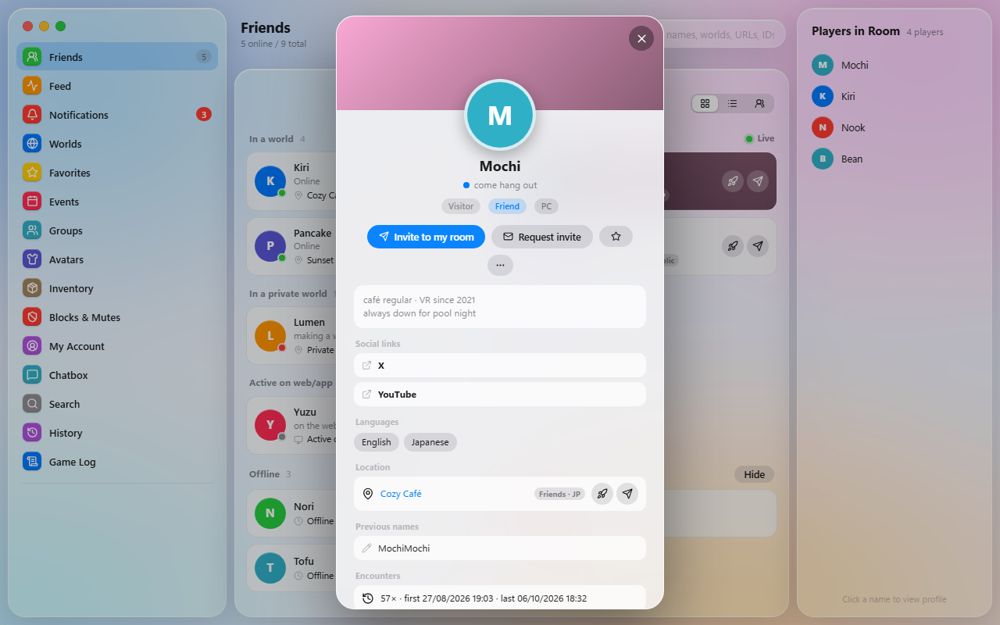<br><sub>Карточка профиля</sub></td></tr>
<tr><td width="50%">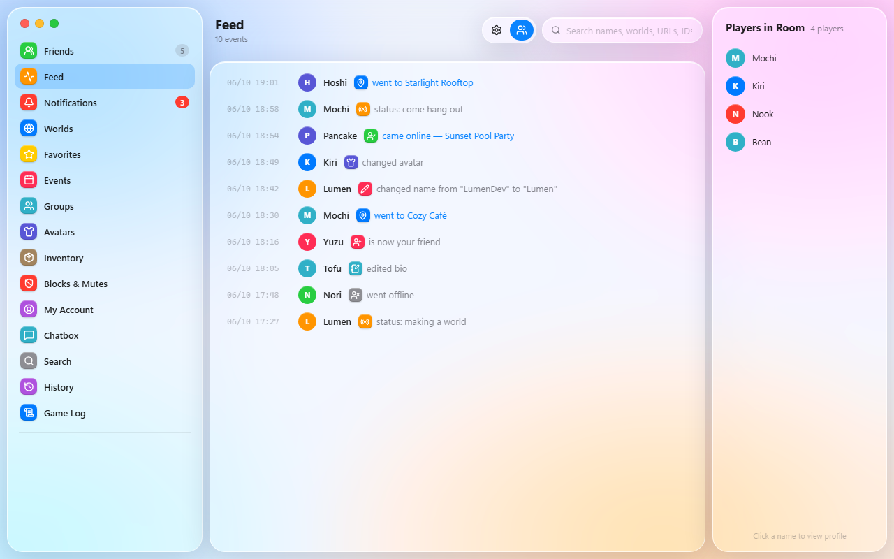<br><sub>Лента</sub></td><td width="50%">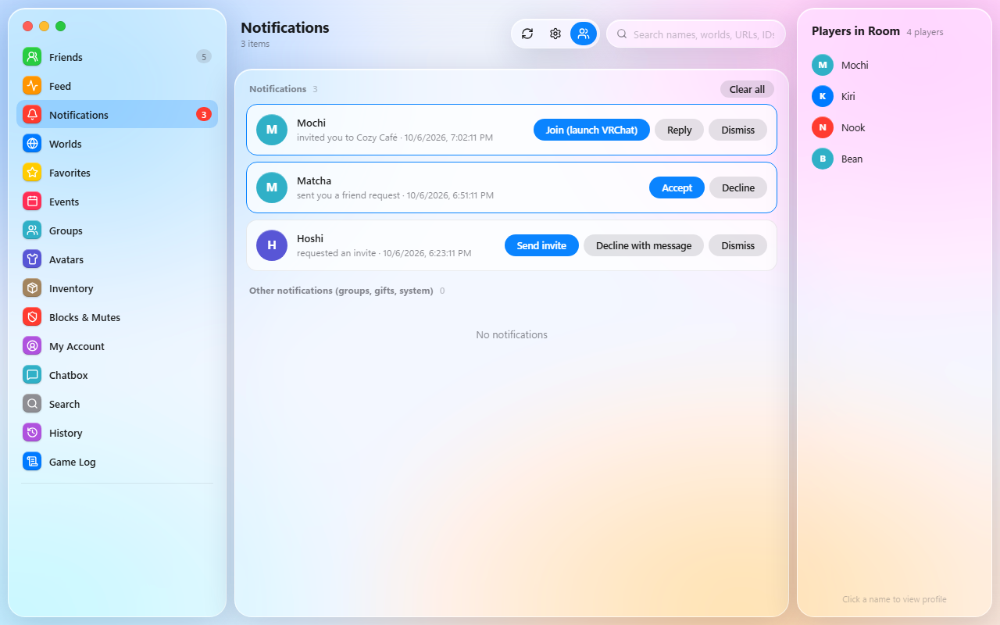<br><sub>Уведомления</sub></td></tr>
<tr><td width="50%"><br><sub>Игровой лог</sub></td><td width="50%">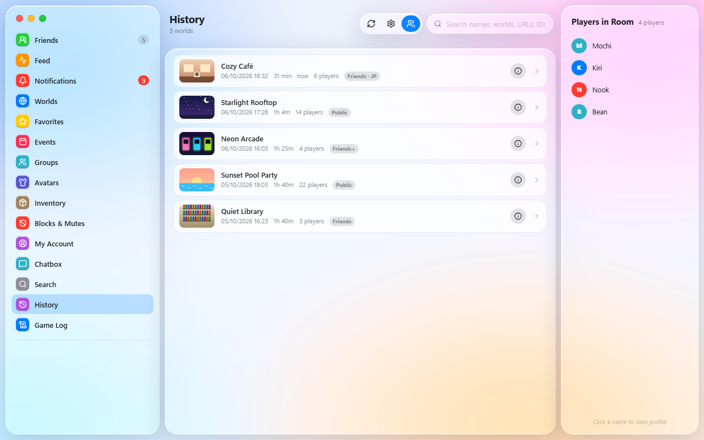<br><sub>История миров</sub></td></tr>
<tr><td width="50%"><br><sub>Чатбокс</sub></td><td width="50%"><br><sub>VR-клавиатура</sub></td></tr>
<tr><td width="50%">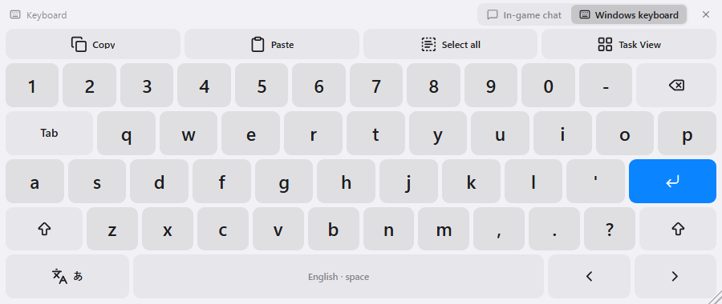<br><sub>Плавающая клавиатура: режим Windows</sub></td><td width="50%">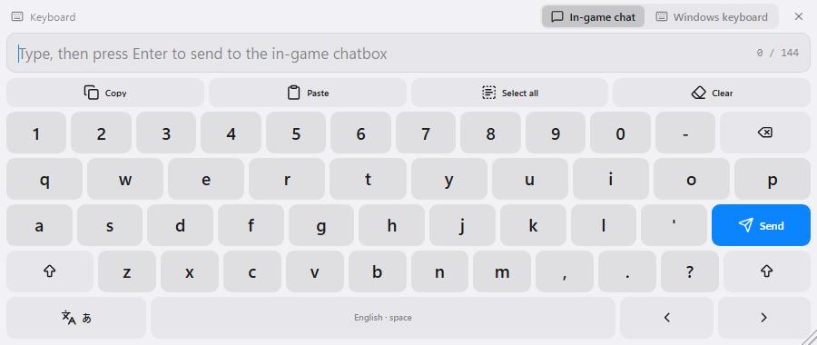<br><sub>Плавающая клавиатура: игровой чат</sub></td></tr>
<tr><td width="50%">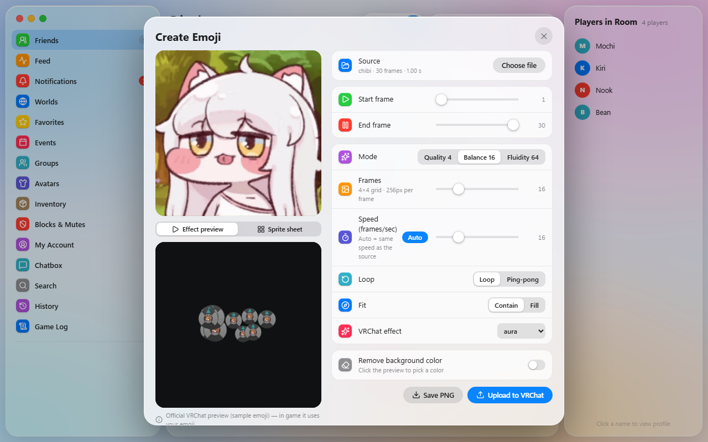<br><sub>Редактор эмодзи: превью эффекта VRChat</sub></td><td width="50%">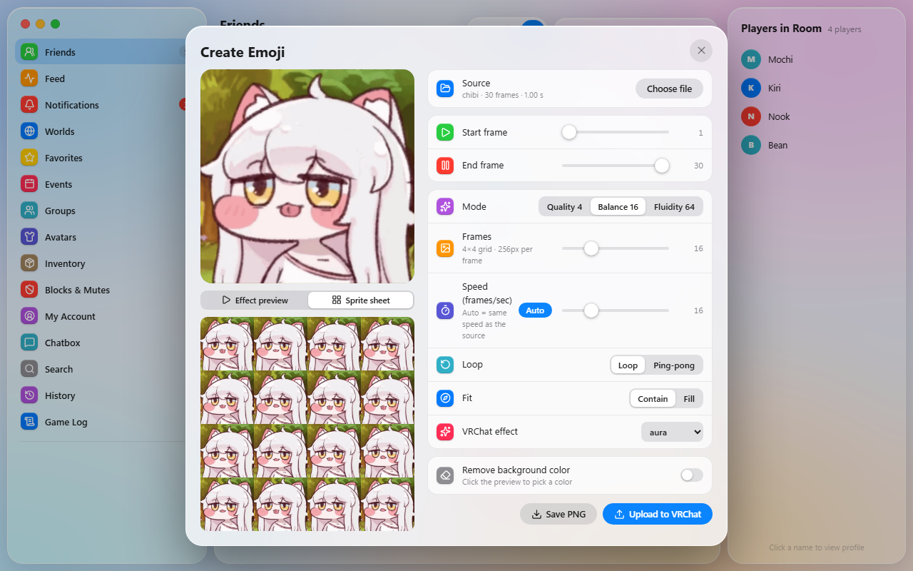<br><sub>Редактор эмодзи: спрайт-лист</sub></td></tr>
<tr><td width="50%"><br><sub>Настройки</sub></td><td width="50%">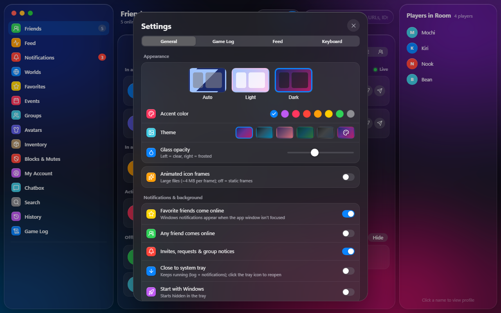<br><sub>Темы и акцентные цвета</sub></td></tr>
<tr><td width="50%">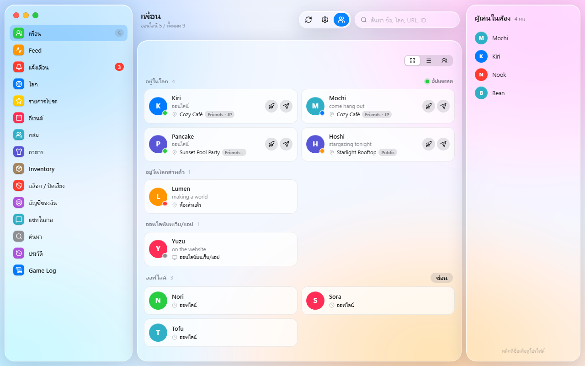<br><sub>Интерфейс на тайском</sub></td><td width="50%">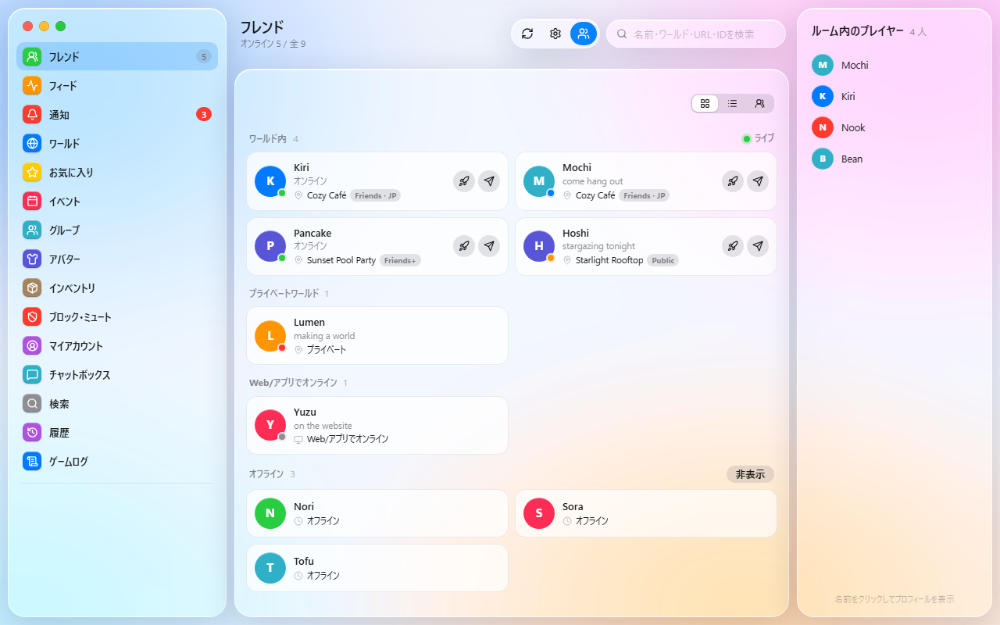<br><sub>Интерфейс на японском</sub></td></tr>
<tr><td width="50%"><br><sub>Вход с выбором языка</sub></td><td></td></tr>
</table>

<sub>На скриншотах вымышленные демо-данные.</sub>

## Лёгкость

- **Один файл ~23 МБ.** Без установщика и без отдельных сред выполнения (Python уже внутри).
- **Без встроенного браузера.** Интерфейс работает на WebView2, который уже есть в Windows, поэтому приложение не тащит с собой Chromium.
- **Бережно к API VRChat.**
  - Все фоновые запросы идут через одну очередь с ограничением частоты.
  - Изображения кэшируются на диске и запрашиваются в малом размере.
  - Картинки друзей не в сети загружаются только при открытии профиля.
- **Тихо в фоне.** Игровой лог читается построчно (только новые строки), приложение может жить в трее.
- **Все данные в одном месте:** `%APPDATA%\VRCNook`. Папку `cache\` можно удалить в любой момент.

## Возможности

### Друзья и общение
- **Список друзей в реальном времени** через WebSocket VRChat. Друзья разделены на группы: в публичном мире, в приватном мире, онлайн на сайте, не в сети.
- **Вид:** можно переключать режим отображения и видеть, когда каждый друг был в сети.
- **Карточки профиля:** баннер, рамка профиля, значки, описание, ссылки, общие друзья, история имён.
  - Личные заметки синхронизируются с VRChat.
  - Действия: пригласить, запросить приглашение, Boop с эмодзи, избранное, блокировка и заглушение.
- **Лента:** смена статуса, местоположения, аватара и имени у друзей.
- **Уведомления:** приглашения, запросы в друзья, уведомления групп. Можно ответить готовым сообщением (с картинкой при VRC+).
- **Уведомления Windows** и значок в трее. По желанию — автозапуск вместе с Windows.

### Игровой лог
- **Чтение лога VRChat в реальном времени:** входы в миры, вход и выход игроков, видео, скриншоты, стикеры, отключения и многое другое.
- **Фильтры:** можно выбрать, какие типы событий показывать.
- **Постоянная история:** хранится в локальной базе SQLite. VRChat удаляет свои старые логи, а VRC Nook их сохраняет.
- **Перенесли папку VRChat?** Выберите её в Настройки → Данные → *Папка кэша VRChat* (саму папку или родительскую). Переключение сразу, старые логи импортируются. Если логов ещё нет (новый ПК), VRC Nook подождёт, пока VRChat их создаст.
- **История миров:** все посещённые миры и инстансы со списком встреченных игроков.

### Контент VRChat
- **Миры и инстансы:** просмотр миров, создание инстансов, открытие мира в VRChat, магазин мира.
- **Избранное:** друзья, миры и аватары.
- **События:** календарь событий VRChat и Jams.
- **Группы:** просмотр и управление (участники, приглашения, заявки, баны, инстансы группы).
- **Аватары:**
  - Смена аватара, размер файла и производительность для каждой платформы.
  - Поиск публичных аватаров через avtrdb.com.
- **Инвентарь:** иконки VRC+, фото, принты, эмодзи, стикеры и пропы.
- **Поиск:** пользователи, миры, группы и события. Можно просто вставить ссылку или ID.
- **Мой аккаунт:** описание, ссылки и статус. Управление блокировками и заглушениями.

### Редактор анимированных эмодзи
- **Исходник:** анимированный GIF, анимированный WebP или несколько картинок (по одному кадру).
- **Редактирование:**
  - Выбор диапазона кадров и их количества.
  - Удаление фона хромакеем (щёлкните по превью, чтобы выбрать цвет).
- **Результат:** спрайт-лист 1024×1024 в формате VRChat создаётся автоматически.
- **Превью:** вид каждого стиля анимации по официальным превью VRChat, затем загрузка в один клик.

### Чатбокс в игре (OSC)
- **Страница чата:** текст, набранный в приложении, появляется в игровом чатбоксе. История отправленного сохраняется.
- **Индикатор:** пока вы печатаете, в игре показывается «печатает…». Звук уведомления можно отключить.

### Экранная клавиатура для VR
- **Для VR:** крупные клавиши, изменяемый размер, кнопки «копировать», «вставить» и «выделить всё».
- **Плавающая клавиатура:**
  - Всегда поверх окон и не забирает фокус.
  - **Режим игрового чата:** отправка в чатбокс.
  - **Режим клавиатуры Windows:** ввод в любое приложение, есть кнопка представления задач.
- **Раскладки:** тайская, английская, хирагана и катакана, корейская, русская, вьетнамская, китайский пиньинь, эмодзи.
  - Корейские слоги собираются автоматически.
  - Для вьетнамского и пиньиня есть клавиши тонов.
- **Настройка:** можно выбрать, по каким раскладкам переключает клавиша языка.

### Оформление
- **7 языков интерфейса:** ไทย, English, 日本語, 한국어, Русский, Tiếng Việt, 中文
- **Темы:** светлая и тёмная, плюс свои цвета градиента.
- **Шрифты:** Noto Sans Thai и другие Google Fonts. Размер текста тоже настраивается.
- **Окно:** поверх всех окон, сворачивание в трей.

### Обновления
- **Автопроверка:** при запуске приложение проверяет GitHub Releases и обновляется в один клик.
- **Проверка файла:** загрузка идёт только из этого репозитория, и файл устанавливается лишь при совпадении SHA-256.

## Конфиденциальность и безопасность

- **Пароль не сохраняется.** Он отправляется напрямую в VRChat.
  - Хранится только cookie сессии, зашифрованный Windows DPAPI: расшифровать его может лишь ваша учётная запись Windows.
- **Cookie входа отправляется только на `api.vrchat.cloud`.** При перенаправлении на другой хост он удаляется.
- **Все данные хранятся на вашем ПК** в `%APPDATA%\VRCNook`:
  - настройки
  - база игрового лога
  - заметки и история чата
  - кэш изображений
- **Другие подключения:**
  - [avtrdb.com](https://avtrdb.com): только при поиске публичных аватаров, отправляется лишь текст запроса.
  - Google Fonts: только если выбран веб-шрифт.
  - `assets.vrchat.com`: превью эффектов.
  - `api.github.com`: проверка обновлений.

## Папка данных

```
%APPDATA%\VRCNook\
├─ session.bin     зашифрованная сессия входа
├─ settings.json   настройки
├─ data.db         игровой лог, лента, заметки, история имён и чата (SQLite)
├─ debug.log       журнал ошибок
└─ cache\          изображения и данные профилей (можно удалить)
```

## Сборка из исходников

```powershell
pip install -r requirements.txt
python vrclog_mac.py          # запуск
.\build.ps1                   # сборка dist\VRCNook.exe
```

Описание файлов — в [английском README](README.md#build-from-source).

## Благодарности

- Автор: **iriewiew**
- Иконки: [Lucide](https://lucide.dev) (ISC License)
- Идея редактора анимированных эмодзи — [VRCEmoji](https://github.com/Wakamu/VRCEmoji) от Wakamu. Написан с нуля, без общего кода.
- Справка по API: [vrchat.community](https://vrchat.community)
- Идеи вдохновлены [VRCX](https://github.com/vrcx-team/VRCX). VRC Nook написан с нуля и не использует его код.

## Лицензия

[MIT](LICENSE) © iriewiew

> VRC Nook — фанатский инструмент, он не связан с VRChat Inc. и не одобрен ею.
> Приложение использует API VRChat, который официально не поддерживается для сторонних приложений. Используйте на свой риск и соблюдайте Условия использования VRChat.
