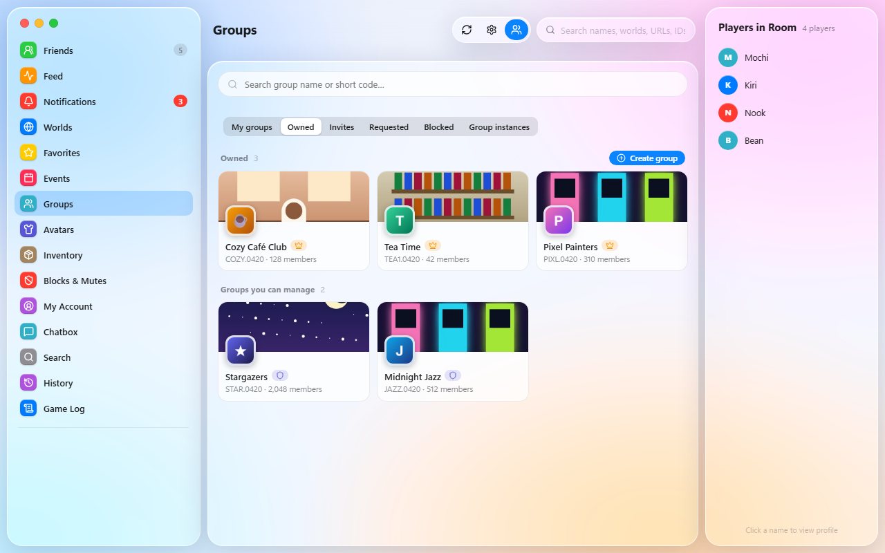
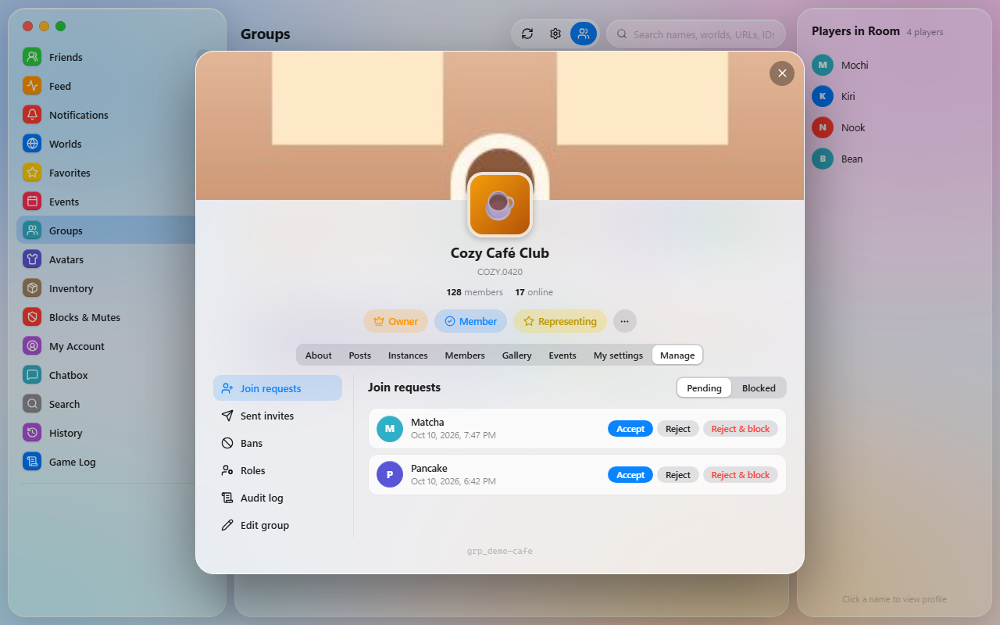
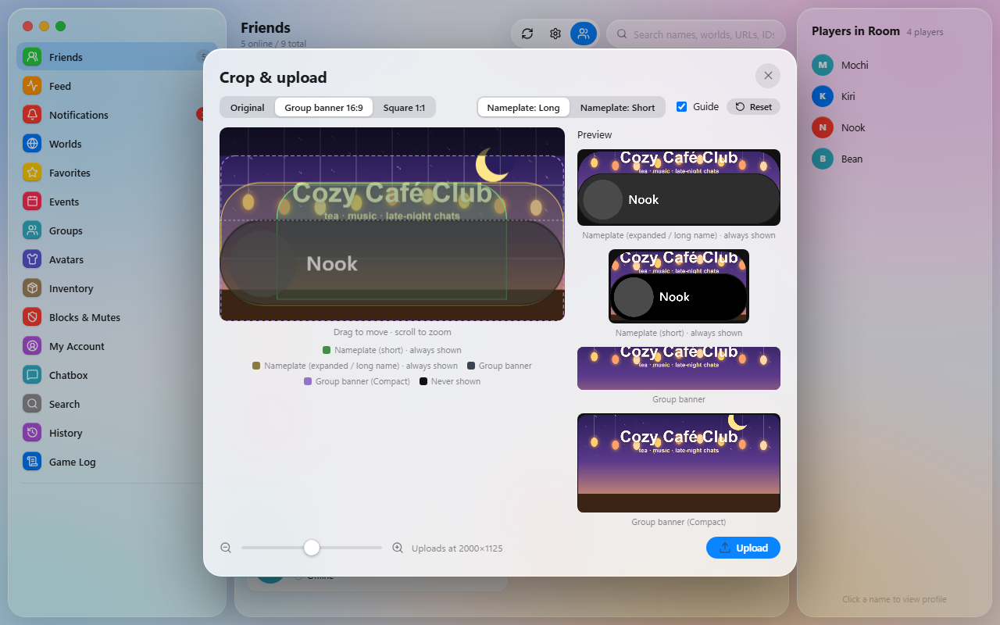

<p align="center"></p>

<h1 align="center">VRC Nook</h1>

<p align="center">轻量又温馨的 Windows 版 VRChat 一站式助手:好友、游戏日志、游戏内聊天框、VR 友好的键盘和动态表情制作器。</p>

<p align="center">
<a href="README.md">English</a> · <a href="README.th.md">ไทย</a> · <a href="README.ja.md">日本語</a> · <a href="README.ko.md">한국어</a> · <a href="README.ru.md">Русский</a> · <a href="README.vi.md">Tiếng Việt</a> · <b>中文</b>
</p>

---

<p align="center"></p>

## 下载

从[最新版本](https://github.com/iriewiew/vrc-nook/releases/latest)下载 `VRCNook.exe` 直接运行,无需安装。
请放在可写入的文件夹(例如"文档")中。应用会直接覆盖自身来更新,所以不要放在 Program Files。

**系统要求:** Windows 10/11,并装有 Microsoft Edge WebView2(Windows 11 已内置)。

## 截图

<table>
<tr><td width="50%"><br><sub>好友(深色主题)</sub></td><td width="50%"><br><sub>个人资料卡</sub></td></tr>
<tr><td width="50%"><br><sub>动态</sub></td><td width="50%"><br><sub>通知</sub></td></tr>
<tr><td width="50%"><br><sub>游戏日志</sub></td><td width="50%"><br><sub>世界历史</sub></td></tr>
<tr><td width="50%"><br><sub>聊天框</sub></td><td width="50%"><br><sub>VR 键盘</sub></td></tr>
<tr><td width="50%"><br><sub>悬浮键盘:Windows 模式</sub></td><td width="50%"><br><sub>悬浮键盘:游戏聊天模式</sub></td></tr>
<tr><td width="50%"><br><sub>表情制作器:VRChat 特效预览</sub></td><td width="50%"><br><sub>表情制作器:精灵图</sub></td></tr>
<tr><td width="50%"><br><sub>设置</sub></td><td width="50%"><br><sub>主题与强调色</sub></td></tr>
<tr><td width="50%"><br><sub>泰语界面</sub></td><td width="50%"><br><sub>日语界面</sub></td></tr>
<tr><td width="50%"><br><sub>拥有和可管理的群组</sub></td><td width="50%"><br><sub>群组管理标签页</sub></td></tr>
<tr><td width="50%"><br><sub>裁剪上传：群组横幅参考线</sub></td><td width="50%"><br><sub>带语言选择的登录</sub></td></tr>
</table>

<sub>截图使用的是虚构的演示数据。</sub>

## 轻量

- **单个约 23 MB 的文件:** 无需安装,也不用另装运行环境(已内置 Python)。
- **不自带浏览器:** 界面运行在 Windows 自带的 WebView2 上,无需捆绑整套 Chromium。
- **对 VRChat API 友好:**
  - 所有后台请求都经过同一个限速队列。
  - 图片缓存在本地并以小尺寸获取。
  - 离线好友的图片只在打开资料时才加载。
- **后台安静运行:** 游戏日志只读取新增的行,应用可常驻系统托盘。
- **数据集中存放:** 全部位于 `%APPDATA%\VRCNook`,`cache\` 可随时删除以释放空间。

## 功能

### 好友与社交
- **实时好友列表:** 通过 VRChat WebSocket 获取,分为:在公开世界、在私人世界、网页在线、离线。
- **视图:** 可切换显示方式,并查看每位好友的最后在线时间。
- **个人资料卡:** 横幅、头像框、徽章、简介、链接、共同好友、改名记录。
  - 个人备注与 VRChat 同步。
  - 可在卡片上操作:邀请、请求邀请、带表情的 Boop、收藏、屏蔽或静音。
- **动态:** 好友的状态、位置、模型和显示名称变化。
- **通知:** 邀请、好友请求、群组通知。可用预设消息回复(拥有 VRC+ 时可附图)。
- **Windows 通知**与系统托盘图标,可设置随 Windows 启动。

### 游戏日志
- **实时读取 VRChat 日志:** 进入世界、玩家进出、视频、截图、贴纸、断线等。
- **筛选:** 可选择要显示的事件类型。
- **永久记录:** 保存在本地 SQLite 数据库。VRChat 会删除旧日志,VRC Nook 会保留下来。
- **移动过 VRChat 文件夹?** 在 设置 → 数据 → *VRChat 缓存文件夹* 中选择(选该文件夹本身或其上级文件夹均可)。会立即切换并导入旧日志。如果还没有日志(新电脑),VRC Nook 会等到 VRChat 写出日志。
- **世界历史:** 去过的所有世界和实例,以及遇到的玩家。

### VRChat 内容
- **世界与实例:** 浏览世界、创建实例、在 VRChat 中打开世界、查看世界商店。
- **收藏:** 好友、世界和模型。
- **活动:** VRChat 活动日历与 Jams。
- **群组:** 浏览与管理(成员、邀请、申请、封禁、群组实例)。
  - 你拥有或可管理的群组单独列在一个标签页中，也可以创建新群组。
  - 所有者和管理员有「管理」标签页：加入申请、邀请（不限好友）、封禁、角色及排序、审核日志，以及编辑名称、图标、横幅和搜索可见性。
- **模型:**
  - 切换模型,并按平台查看文件大小与性能。
  - 通过 avtrdb.com 搜索公开模型。
  - 模型评级为 Very Poor 时显示警告（其他人会看到你的备用模型）。
- **物品栏:** VRC+ 图标、照片、打印照片、表情、贴纸和道具。
  - 上传照片和图标前可裁剪和缩放，附带群组横幅参考线和名牌预览。
- **搜索:** 用户、世界、群组和活动。也可以直接粘贴链接或 ID。
- **我的账号:** 编辑简介、链接和状态,管理屏蔽与静音。

### 动态表情制作器
- **素材:** 动态 GIF、动态 WebP,或多张图片(每张一帧)。
- **编辑:**
  - 选择帧范围和帧数。
  - 用色度键抠除背景(点击预览图取色)。
- **输出:** 自动生成 VRChat 格式的 1024×1024 精灵图。
- **预览:** 用 VRChat 官方预览查看每种动画样式的效果,然后直接上传。

### 游戏内聊天框 (OSC)
- **聊天页面:** 在应用中输入的文字会显示在游戏内聊天框,并保留发送记录。
- **状态提示:** 输入时在游戏中显示"正在输入…"。提示音可开关。

### VR 屏幕键盘
- **为 VR 设计:** 大按键,可调整大小,带复制、粘贴、全选按钮。
- **弹出式悬浮键盘:**
  - 始终置顶,不会抢走焦点。
  - **游戏聊天模式:** 发送到聊天框。
  - **Windows 键盘模式:** 可向任意程序输入,带任务视图按钮。
- **布局:** 泰语、英语、平假名与片假名、韩语、俄语、越南语、汉语拼音和表情。
  - 韩语自动组合音节。
  - 越南语和拼音支持声调键。
- **设置:** 可选择语言切换键循环的布局。

### 个性化
- **7 种界面语言:** ไทย, English, 日本語, 한국어, Русский, Tiếng Việt, 中文
- **主题:** 浅色与深色,以及自定义渐变颜色。
- **字体:** Noto Sans Thai 等 Google Fonts,可调字号。
- **窗口:** 窗口置顶、最小化到托盘。

### 更新
- **自动检查:** 启动时检查 GitHub Releases,一键更新。
- **校验:** 只从本仓库下载,且文件的 SHA-256 一致才会安装。

## 隐私与安全

- **不保存密码。** 密码直接发送给 VRChat。
  - 只保存用 Windows DPAPI 加密的会话 Cookie,只有你的 Windows 账户能解密。
- **登录 Cookie 只发送到 `api.vrchat.cloud`。** 若被重定向到其他主机会先移除。
- **所有数据都保存在本机** `%APPDATA%\VRCNook`:
  - 设置
  - 游戏日志数据库
  - 备注和聊天记录
  - 图片缓存
- **其他连接:**
  - [avtrdb.com](https://avtrdb.com):仅在搜索公开模型时连接,只发送搜索词。
  - Google Fonts:仅在选择网络字体时。
  - `assets.vrchat.com`:特效预览。
  - `api.github.com`:检查更新。

## 数据文件夹

```
%APPDATA%\VRCNook\
├─ session.bin     加密的登录会话
├─ settings.json   设置
├─ data.db         游戏日志、动态、备注、改名记录、聊天记录 (SQLite)
├─ debug.log       错误日志
└─ cache\          图片与资料数据(可删除,会重新获取)
```

## 从源码构建

```powershell
pip install -r requirements.txt
python vrclog_mac.py          # 运行
.\build.ps1                   # 构建 dist\VRCNook.exe
```

各文件说明请见[英文 README](README.md#build-from-source)。

## 致谢

- 作者:**iriewiew**
- 图标:[Lucide](https://lucide.dev) (ISC License)
- 动态表情制作器的创意来自 Wakamu 的 [VRCEmoji](https://github.com/Wakamu/VRCEmoji)。从零编写,未使用其任何代码。
- API 参考:[vrchat.community](https://vrchat.community)
- 创意灵感来自 [VRCX](https://github.com/vrcx-team/VRCX)。VRC Nook 从零编写,未使用其任何代码。

## 许可证

[MIT](LICENSE) © iriewiew

> VRC Nook 是粉丝制作的工具,与 VRChat Inc. 无关,也未获其认可。
> 本应用使用的 VRChat API 并未正式支持第三方应用。使用风险自负,请遵守 VRChat 服务条款。
